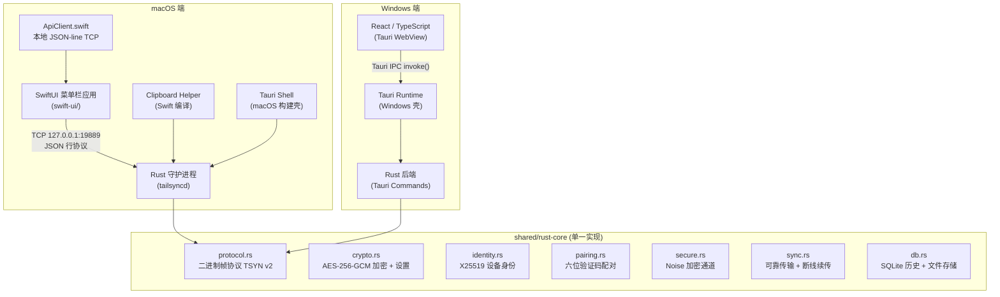

# TailSync 2.0.0 全项目架构深度解析

> 一份逐个文件说明的架构文档，阐述每个文件在整个应用中承担的职责与位置。

---

## 目录

1. [总体架构](#1-总体架构)
2. [项目根目录文件](#2-项目根目录文件)
3. [Windows 前端层 (React + TypeScript)](#3-windows-前端层-react--typescript)
4. [macOS 前端层 (SwiftUI)](#4-macos-前端层-swiftui)
5. [Rust 共享核心层](#5-rust-共享核心层)
6. [网络子系统 (network/)](#6-网络子系统-network)
7. [macOS SwiftUI 原生层](#7-macos-swiftui-原生层)
8. [构建与部署脚本](#8-构建与部署脚本)
9. [测试与验证脚本](#9-测试与验证脚本)
10. [配置文件全览](#10-配置文件全览)

---

## 1. 总体架构



### 核心数据流

```
剪贴板变化 → clipboard.rs 轮询 → sync.rs 广播 → network/ 加密发送
                                         ↓
另一设备 network/ 接收 → sync.rs 去重 → db.rs 存储 → api.rs 通知 UI
```

---

## 2. 项目根目录文件

| 文件 | 职责 |
|------|------|
| [`README.md`](README.md) | 项目总览文档：功能介绍、平台支持、安全模型、端口说明、快速开始、仓库结构 |
| [`LICENSE`](LICENSE) | MIT 开源许可证 |
| `CODE_REVIEW_REPORT.md` | 代码审查报告（开发阶段产物，非运行时代码） |
| `CODE_REVIEW_REMEDIATION_PLAN.md` | 代码审查修复计划（开发阶段产物） |
| `WINDOWS_SLEEP_WAKE_BACKEND_HANDOFF.md` | Windows 睡眠/唤醒时前后端状态交接的技术文档 |

### shared/

| 文件 | 职责 |
|------|------|
| [`shared/rust-core/Cargo.toml`](shared/rust-core/Cargo.toml) | **跨平台 Rust 核心 crate**。协议、加密、身份、配对、历史数据库、安全通道和同步引擎的单一实现 |
| [`shared/rust-core/Cargo.lock`](shared/rust-core/Cargo.lock) | 有意保留：shared core 在 CI 中作为独立根 crate 使用 `--locked` 测试；作为两端 path dependency 时，最终解析仍分别由平台 `Cargo.lock` 决定 |
| [`shared/rust-core/src/lib.rs`](shared/rust-core/src/lib.rs) | 共享模块入口，向两端应用 crate 导出核心模块 |
| [`shared/schema/settings.schema.json`](shared/schema/settings.schema.json) | 由 Rust `Settings` 通过 schemars 生成的 JSON 契约，记录字段、类型、枚举、默认值和数值范围；不要手工编辑 |
| [`shared/schema/generate-settings.mjs`](shared/schema/generate-settings.mjs) | 运行 Rust schema generator，再由 Schema 生成 Windows `SettingsData`；`--check` 会拒绝 Rust→Schema→TypeScript 任一层漂移 |
| [`shared/art-direction.css`](shared/art-direction.css) | Windows React 工具窗口的艺术方向 CSS；macOS 通过 SwiftUI `Theme.swift` 实现相同的主题命名和色彩语义 |

### assets/

| 文件 | 职责 |
|------|------|
| `assets/tailsync-icon.png` | 项目图标（README 使用） |
| `assets/tailsync-theme-comparison.png` | 主题对比截图（README 使用） |

### site/

| 文件 | 职责 |
|------|------|
| [`site/src/App.tsx`](site/src/App.tsx) | 独立营销站点组件，展示产品能力、协议、安全模型和下载入口 |
| [`site/src/landing.css`](site/src/landing.css) | 站点专属视觉与响应式样式 |
| [`site/package.json`](site/package.json) | 独立站点的 React/Vite 构建依赖；不进入 Windows 或 macOS 客户端依赖图 |

---

## 3. Windows 前端层 (React + TypeScript)

Windows 端使用 Tauri 框架，前端为 React 19 + TypeScript 6 + Vite 8 构建的 WebView 应用。

### 入口文件

| 文件 | 职责 |
|------|------|
| [`windows/history.html`](windows/history.html) | **历史记录窗口入口**。独立的 Tauri 多窗口，加载 History 页面 |
| [`windows/settings.html`](windows/settings.html) | **设置窗口入口**。独立的 Tauri 多窗口，加载 Settings 页面 |

### 应用源码 (windows/src/)

| 文件 | 行数 | 职责 |
|------|------|------|
| [`history-main.tsx`](windows/src/history-main.tsx) | ~7 | History 窗口入口，挂载 `History` 页面 |
| [`settings-main.tsx`](windows/src/settings-main.tsx) | ~7 | Settings 窗口入口，挂载 `Settings` 页面 |

### 页面组件 (windows/src/pages/)

| 文件 | 行数 | 职责 |
|------|------|------|
| [`History.tsx`](windows/src/pages/History.tsx) | ~1200 | **剪贴板历史记录窗口**。功能：搜索/过滤历史条目（关键词、分类、日期范围）、分页加载、文本/图片/文件预览、删除/恢复条目、清空历史、显示传输进度。通过 `invoke()` 调用 Tauri Commands 与 Rust 后端通信 |
| [`Settings.tsx`](windows/src/pages/Settings.tsx) | ~1200 | **设置窗口**。功能：连接模式选择（auto/lan_only/tailscale_only）、设备发现与管理（LAN/Tailscale 候选、信任/配对/遗忘）、主题切换（五套色彩主题 × 系统/浅色/深色）、语言切换（EN/中文）、通知开关、历史记录数量限制、清除所有数据。通过 `invoke()` 读写后端配置 |

### Hooks (windows/src/hooks/)

| 文件 | 职责 |
|------|------|
| [`useI18n.ts`](windows/src/hooks/useI18n.ts) | **国际化 Hook**。从 `localStorage` 读取语言偏好，无偏好时回退到系统语言（`navigator.language`）。提供 `t(key)` 翻译函数，支持 `en` / `zh-CN` 两种语言，翻译结果缓存在模块作用域 |
| [`useTheme.ts`](windows/src/hooks/useTheme.ts) | **主题 Hook**。管理明暗模式（system / light / dark）和五套色彩主题（tailsync / canvas / flux / ledger / aura / mono），通过 CSS 自定义属性注入到 `document.documentElement`，响应系统主题变化 |

### 国际化 (windows/src/i18n/)

| 文件 | 职责 |
|------|------|
| [`en.json`](windows/src/i18n/en.json) | 英文翻译字符串表（所有 UI 文本） |
| [`zh-CN.json`](windows/src/i18n/zh-CN.json) | 简体中文翻译字符串表 |

### 样式 (windows/src/)

| 文件 | 行数 | 职责 |
|------|------|------|
| [`index.css`](windows/src/index.css) | 4 | **样式入口**。只导入 `styles/theme.css`、`history.css`、`settings.css` 和 `utilities.css`；主题变量、页面组件与通用工具样式分开维护 |

---

## 4. macOS 前端层 (SwiftUI)

macOS 只保留一套产品 UI：`macos/swift-ui/` 下的原生 SwiftUI 菜单栏、History 和 Settings 窗口。SwiftUI 通过带 256 位能力令牌的本地 JSON-lines API 控制 Rust 守护进程，令牌在启动时经匿名 stdin 管道一次性传递。原 React/Vite 页面和 Node 构建链已经退役。

`macos/src-tauri/frontend/index.html` 只是无窗口 Tauri runtime 在编译时需要的空静态资源，不承担任何产品界面职责。SwiftUI 文件的详细说明见[第 7 节](#7-macos-swiftui-原生层)。

---

## 5. Rust 共享核心层

`shared/rust-core/` 是跨平台业务规则的唯一实现。Windows 和 macOS 的应用 crate 通过 path dependency 使用它，只在各自的 `src-tauri/src/` 中保留生命周期、剪贴板、网络发现/连接管理、UI 桥接等平台适配代码。`SyncPlatform` trait 将共享同步引擎与 Tauri 剪贴板、进度事件和历史恢复解耦。

### 程序入口

| 文件 | 行数 | 职责 |
|------|------|------|
| [`main.rs`](macos/src-tauri/src/main.rs) | ~5 | **二进制入口点**。Windows 端通过 `#![windows_subsystem = "windows"]` 隐藏控制台窗口。仅一行：`tailsync_lib::run()` 将所有权交给 lib.rs |
| [`lib.rs (macOS)`](macos/src-tauri/src/lib.rs) | ~370 | **macOS 端应用生命周期管理**。职责：①模块声明（14 个子模块）；② `AppState` 结构体定义（全局状态：DB、SyncEngine、Settings、DeviceIdentity、ConnectionPool、PairingManager、Shutdown）；③ `run_app()` 初始化流程：先加载加密密钥和设置→初始化 SQLite→启动历史分类回填→创建所有核心组件→启动后台任务（JSON API Server、剪贴板监听、P2P 网络服务、UDP 发现应答、对等健康监控）→注册 Tauri Commands→启动 Tauri 应用；④ `coordinate_shutdown()` 优雅停机协调；⑤ `start_parent_monitor()` 监控 SwiftUI 父进程存活状态（macOS 特有） |
| [`lib.rs (Windows)`](windows/src-tauri/src/lib.rs) | ~425 | **Windows 端应用生命周期管理**。与 macOS 版核心逻辑相同，差异点：①无 `hide_bundled_daemon_from_dock()`；② `start_parent_monitor()` 为空实现（Windows 无父子进程模式）；③ 增加了 `start_background_notifications()` 在 Windows 端通过 Tauri Notification API 发送后台通知；④ 额外的 `test_connection` 命令 |

### 协议层

| 文件 | 行数 | 职责 |
|------|------|------|
| [`protocol.rs`](shared/rust-core/src/protocol.rs) | ~520 | **TSYN v2 二进制帧协议定义**。这是整个系统最基础的通信契约：<br/>① 帧结构：Magic(4) + Ver(1) + Flags(1) + Cmd(2) + Seq(4) + Len(4) + Payload(var) + Blake3(32) = 头部 16 字节 + 校验和 32 字节<br/>② 命令码：握手请求/应答、文本/图片/文件元数据/文件分块/事件 ACK/文件偏移 ACK/心跳<br/>③ 事件信封（EVT1）：带时间戳窗口校验和消息 ID 去重<br/>④ 文件分块（FCH1）：TransferId + offset + data，支持 1MiB 分块和断线续传<br/>⑤ 图片打包（IMG1）：尺寸和像素格式验证<br/>⑥ 各个载荷大小上限常量 |

### 加密与设置

| 文件 | 行数 | 职责 |
|------|------|------|
| [`crypto.rs`](shared/rust-core/src/crypto.rs) | ~1200 | **加密子系统与持久化设置**。职责：<br/>① `get_dek()` / `create_dek()`：AES-256-GCM 数据加密密钥（DEK）管理，通过 `OnceLock` 缓存，确保"读不到就绝不生成新密钥"的安全策略<br/>② `encrypt()` / `decrypt()`：用于历史记录内容的 AES-256-GCM 加密/解密<br/>③ `Settings` 结构体：所有可持久化配置——通知、进度条、历史限制、启用的对等设备、主题、语言、连接模式、信任的公钥映射、已知设备地址、配对端点<br/>④ 设置序列化到 `~/.tailsync/config-v2.json`（或系统应用数据目录）<br/>⑤ 兼容旧版设置项（`manual`→`lan_only`、`tailsync`→默认主题） |

### 设备身份

| 文件 | 行数 | 职责 |
|------|------|------|
| [`identity.rs`](shared/rust-core/src/identity.rs) | ~560 | **X25519 设备身份管理**。职责：<br/>① `DeviceIdentity`：持有 32 字节 X25519 静态密钥对，附带版本号、创建时间和指纹<br/>② `load_or_create()`：从 `identity-v1.bin` 加载，文件不存在则生成新身份<br/>③ 指纹计算：公钥的 Blake3 哈希前 8 字节，用 base64url 编码<br/>④ 并发初始化保护：多线程同时 `load_or_create()` 保证只产生一份身份<br/>⑤ Noise 协议名称固定为 `Noise_XX_25519_ChaChaPoly_BLAKE2s`<br/>⑥ 错误处理：区分文件不存在 / 权限拒绝 / 数据损坏 / 加密失败 |

### 配对管理

| 文件 | 行数 | 职责 |
|------|------|------|
| [`pairing.rs`](shared/rust-core/src/pairing.rs) | ~590 | **设备配对子系统**。职责：<br/>① `derive_verification_code()`：从 Noise 握手哈希 + 双方公钥派生出六位验证码<br/>② `PairingManager`：管理配对窗口生命周期（默认 120 秒）、失败计数（5 次锁定）、双方确认状态<br/>③ 配对成功后将对方公钥写入 `trusted_peer_keys`，地址写入 `trusted_peer_addresses`<br/>④ 支持取消配对和超时自动关闭 |

### 数据库

| 文件 | 行数 | 职责 |
|------|------|------|
| [`db.rs`](shared/rust-core/src/db.rs) | ~2000 | **SQLite 历史数据库主模块**。提供 `HistoryDB`、条目生命周期、分类回填和媒体恢复；Schema v7 支持文本、图片、文件、分类标签、数据哈希和源设备标识 |
| [`db/schema.rs`](shared/rust-core/src/db/schema.rs) | ~50 | 建立基础表、索引和迁移诊断表 |
| [`db/migrations.rs`](shared/rust-core/src/db/migrations.rs) | ~600 | 执行 v1→v7 schema/存储迁移并记录可重试诊断；v7 结构升级立即完成，旧明文文件由独立 SQLite 连接按小批次后台转换为加密容器 |
| [`db/legacy_v1.rs`](shared/rust-core/src/db/legacy_v1.rs) | ~370 | 自动导入 Fernet 加密的 TailSync v1 历史，按内容哈希保持幂等，原数据库与密钥保留 |
| [`db/file_storage.rs`](shared/rust-core/src/db/file_storage.rs) | ~230 | 安全文件名、版本化引用、5 GiB 字节配额及受控剪贴板物化 |
| [`db/file_encryption.rs`](shared/rust-core/src/db/file_encryption.rs) | ~550 | `TSFENC1` 文件容器：HKDF-SHA256 派生文件密钥、1 MiB 分块 AES-256-GCM、BLAKE3 校验和原子替换；格式细节见 [ADR 0001](docs/adr/0001-file-history-encryption.md) |
| [`db/queries.rs`](shared/rust-core/src/db/queries.rs) | ~160 | 搜索、分类、日期与稳定分页查询构造 |
| [`db/lifecycle.rs`](shared/rust-core/src/db/lifecycle.rs) | ~200 | 删除、清空、按条数/字节裁剪，以及无引用外部文件的生命周期清理 |
| [`db/types.rs`](shared/rust-core/src/db/types.rs) | ~35 | 历史条目和迁移诊断等数据库对外 DTO |

### 历史分类器

| 文件 | 行数 | 职责 |
|------|------|------|
| [`history_classifier.rs`](shared/rust-core/src/history_classifier.rs) | ~1100 | **内容自动分类引擎**。职责：<br/>① 8 种分类：text、website、code、command、structured_data、path、image、file<br/>② 分类逻辑：基于前缀扫描（最多 16KB）、正则匹配、结构化探测（JSON/XML/YAML）<br/>③ 置信度打分：单一类别高置信度 vs 模糊分类带 secondary_category<br/>④ `backfill_classifications()`：增量回填旧条目，支持中断续传 |

### 剪贴板监听

| 文件 | 行数 | 职责 |
|------|------|------|
| [`clipboard.rs`](macos/src-tauri/src/clipboard.rs) | ~710 | **系统剪贴板轮询与同步**。职责：<br/>① `start_monitor()`：启动后台任务，按优先级轮询：文件剪贴板→文本→图片<br/>② 回环过滤：检测内容是否来自本设备（`source_peer == "self"`），防止重复同步<br/>③ 托管文件过滤：TailSync 写入剪贴板的文件不再广播，但过滤规范路径和符号链接别名<br/>④ 健康监控：记录最后活跃时间，供 `monitor_is_healthy()` 查询<br/>⑤ 平台特定实现：macOS 通过 `NSPasteboard.changeCount` 检测变化，Windows 通过剪贴板序列号 |

| 文件 | 行数 | 职责 |
|------|------|------|
| [`clipboard_change.rs`](macos/src-tauri/src/clipboard_change.rs) | ~120 | **剪贴板变化检测器**（macOS 专用）。通过 `NSPasteboard.changeCount()` 追踪变化，比较序列号判断是否有新内容，避免处理同一个变化多次 |
| [`clipboard_file.rs`](macos/src-tauri/src/clipboard_file.rs) | ~170 | **文件剪贴板读取**。macOS 通过编译后的 Swift helper（瞬时启动，非每调用启动子进程），Windows 通过 Win32 `CF_HDROP` API。返回剪贴板中的文件路径列表 |

### 同步引擎

| 文件 | 行数 | 职责 |
|------|------|------|
| [`sync.rs`](shared/rust-core/src/sync.rs) | ~700 | **可靠的剪贴板同步引擎**。职责：<br/>① `SyncEngine`：协调本地剪贴板变化→广播到在线对等设备→接收对等设备内容→写入本地历史<br/>② Shadow Filter：30 秒 TTL 的内容哈希追踪，用于去重和计数重复<br/>③ 可靠消息投递：消息 ACK、自动重试（最多 4 次，750ms 超时，250ms 基础回退延迟）<br/>④ 文件传输管理：TransferId 追踪、断线续传恢复、分块接收状态持久化到磁盘<br/>⑤ `ReceivedFileManager`：管理活跃的文件接收会话，每对等设备限 2 个、全局限 8 个<br/>⑥ 24 小时未完成的传输自动清理<br/>⑦ `SyncPlatform`：将剪贴板写入、进度事件、文件完成和历史恢复委托给平台适配层 |

### JSON API 服务器

| 文件 | 行数 | 职责 |
|------|------|------|
| [`api.rs`](macos/src-tauri/src/api.rs) | ~620 | **JSON-line API 外观与平台剪贴板桥接**。维护剪贴板版本、进度和公开入口，具体传输、导入与路由分到 `api/` 子模块 |
| [`api/transport.rs`](macos/src-tauri/src/api/transport.rs) | ~250 | loopback 监听、连接上限、逐行请求、读取超时、请求大小限制和 256 位能力令牌认证 |
| [`api/imports.rs`](macos/src-tauri/src/api/imports.rs) | ~250 | `begin_import` / `import_chunk` / `finish_import` 分块导入状态机与全局字节配额 |
| [`api/routes.rs`](macos/src-tauri/src/api/routes.rs) | ~1000 | 历史、设备、配对、设置、健康和关闭命令路由；Windows 端保持相同协议边界 |

### Tauri 命令桥

| 文件 | 行数 | 职责 |
|------|------|------|
| [`commands.rs`](macos/src-tauri/src/commands.rs) | ~400 | **Tauri IPC 适配层**。复用与本地 JSON API 相同的历史、设备、配对、设置、图片和进度逻辑。macOS 不再注册打开 WebView History/Settings 的命令；原生窗口由 SwiftUI 管理。Windows 端保留窗口命令并额外提供 `test_connection` |

### 系统托盘

| 文件 | 行数 | 职责 |
|------|------|------|
| [`tray.rs`](windows/src-tauri/src/tray.rs) | ~280 | **Windows Tauri 系统托盘实现**。macOS 菜单栏由 `TailSyncApp.swift` 原生管理，不再携带第二套 Tauri tray |

---

## 6. 网络子系统 (network/)

网络层是整个应用最复杂的子系统，负责设备发现、连接管理、安全传输和健康状况监控。

### network/mod.rs — 连接池与服务器

| 文件 | 行数 | 职责 |
|------|------|------|
| [`network/mod.rs`](macos/src-tauri/src/network/mod.rs) | Windows ~1490 / macOS ~1345 | **网络协调主模块**。其中生产逻辑分别约 624/537 行，其余约 866/808 行是平台行为回归测试；保留发现源合并、连接策略与后台任务编排 |
| `network/pool.rs` | ~360 | `ConnectionPool`、认证连接注册、优先/文件发送通道和连接复用 |
| `network/server.rs` | ~300 | TCP 19890 入站接受、Noise 握手、身份校验和连接任务生命周期 |
| `network/health.rs` | ~300 | 主动探测、状态转换、延迟统计和对等健康监控 |
| `network/peer_cache.rs` | ~250 | LAN、mDNS、Tailscale 候选缓存合并与刷新循环；Windows/macOS 使用同一模块边界 |
| `network/rate_limit.rs` | ~140 | 每对端事件/字节 Token Bucket、空闲预算清理和预算表容量上限 |
| `network/types.rs` | ~60 | 平台网络 DTO 与状态枚举；两端序列化模型存在有意差异，由跨平台契约脚本显式登记 |

### network/secure.rs — Noise 加密传输

| 文件 | 行数 | 职责 |
|------|------|------|
| [`secure.rs`](shared/rust-core/src/secure.rs) | ~320 | **Noise XX 安全握手与加密通道**。职责：<br/>① `SecureConnection`：封装 Noise `TransportState` + TCP 流，提供 `read_frame()` / `write_frame()`<br/>② `AcceptedConnection`：包含已验证的对等信息（主机名、Tailscale IP、远程公钥、握手哈希）<br/>③ `HandshakePurpose`：区分普通连接握手和配对握手<br/>④ 反序列化后的帧通过 `read_frame_with_admission()` 进行命令级准入过滤<br/>⑤ 最大传输记录 65535 字节，分片支持大载荷 |

### network/lan.rs — LAN 设备发现

| 文件 | 行数 | 职责 |
|------|------|------|
| [`lan.rs`](macos/src-tauri/src/network/lan.rs) | ~270 | **LAN UDP 广播发现**。职责：<br/>① 向局域网广播 `TAILSYNC_DISCOVER_V1` 请求（端口 19889）<br/>② 650ms 窗口内收集所有响应，解析主机名、TCP 端口、版本号<br/>③ 自过滤：排除本机（通过主机名或本地 IP 匹配）<br/>④ 获取本机主机名（Windows: `COMPUTERNAME`，macOS/Linux: `HOSTNAME` 或 `/bin/hostname`） |

### network/mdns.rs — mDNS/DNS-SD 发现

| 文件 | 行数 | 职责 |
|------|------|------|
| [`mdns.rs`](macos/src-tauri/src/network/mdns.rs) | ~240 | **mDNS 服务发现**。职责：<br/>① 注册 `_tailsync._tcp.local.` DNS-SD 服务<br/>② 发现局域网内其他 TailSync 设备的 mDNS 广播<br/>③ 缓存最近发现的记录（Mutex 保护）<br/>④ 自过滤（排除本机全名或指纹匹配的记录）<br/>⑤ 崩溃恢复：`run_once()` 失败后自动重试 |

### network/tailscale.rs — Tailscale 集成

| 文件 | 行数 | 职责 |
|------|------|------|
| [`tailscale.rs`](macos/src-tauri/src/network/tailscale.rs) | ~290 | **Tailscale 网络集成**。职责：<br/>① 调用 `tailscale status --json` 获取 Tailnet 中所有设备状态<br/>② 解析 JSON 输出，提取主机名、Tailscale IP、在线状态<br/>③ `PeerInfo` / `LocalInfo`：对等设备信息结构和本机信息结构<br/>④ 平台特定二进制查找：Windows 检查 `%LOCALAPPDATA%\Tailscale\tailscale.exe` 等路径，macOS 检查 `/Applications/Tailscale.app` 等<br/>⑤ 探测对等设备是否运行 TailSync（向 Tailscale IP 发送 UDP 探测） |

---

## 7. macOS SwiftUI 原生层

macOS 端有一套独立的 SwiftUI 原生应用作为菜单栏控制器，不依赖 Tauri WebView 做主要 UI。

### 应用入口

| 文件 | 职责 |
|------|------|
| [`swift-ui/Sources/TailSync/TailSyncApp.swift`](macos/swift-ui/Sources/TailSync/TailSyncApp.swift) | **macOS 菜单栏应用主入口**。职责：<br/>① `@main` SwiftUI App，使用 `NSApplicationDelegateAdaptor`<br/>② `AppDelegate`：完整的应用生命周期管理——强制 `accessory` 激活策略（无 Dock 图标）、创建状态栏图标、启动 Rust 守护进程、注册通知权限、启动通知轮询器、启动守护进程看门狗、注册睡眠/唤醒通知<br/>③ 状态栏菜单：左键打开 History 窗口，右键显示菜单（History/Settings/当前路由/退出）<br/>④ 守护进程管理：`launchDaemon()` 查找并启动 `tailsyncd` 二进制、`stopDaemon()` 优雅停机（API 请求→SIGTERM→SIGKILL 降级链）<br/>⑤ **睡眠/唤醒处理**：系统唤醒后等待 2 秒让 Tailscale 重连，然后检查守护进程健康，不健康则重启<br/>⑥ 通知系统：使用 `UNUserNotificationCenter`（非 osascript），0.5 秒轮询间隔，首次建立基线避免重复通知<br/>⑦ 看门狗：每 3 秒检查守护进程健康（API + TCP Server + Clipboard Monitor），连续 2 次失败则重启 |

### 视图层

| 文件 | 行数 | 职责 |
|------|------|------|
| [`Views/HistoryView.swift`](macos/swift-ui/Sources/TailSync/Views/HistoryView.swift) | ~400 | **历史记录视图**（SwiftUI 原生）。功能对应 Windows 端的 React History 页面：搜索栏（带分类和日期过滤）、条目列表（文本/图片/文件）、缩略图预览、删除/恢复操作、加载更多分页、空状态占位图、传输进度显示 |
| [`Views/SettingsView.swift`](macos/swift-ui/Sources/TailSync/Views/SettingsView.swift) | ~500 | **设置视图**（SwiftUI 原生）。包含：连接模式选择、设备发现列表（LAN/Tailscale 候选分别显示，含在线状态和延迟）、主题与外观设置、通知和历史限制、语言切换、配对管理、危险操作（清除数据）。使用 `SettingsSaveCoordinator` actor 保证并发写入串行化 |

### 模型层

| 文件 | 职责 |
|------|------|
| [`Models/Settings.swift`](macos/swift-ui/Sources/TailSync/Models/Settings.swift) | **设置数据模型**。`AppSettings` 结构体：与 Rust 端 `Settings` 结构体对应的 Swift 表示，含所有可持久化字段和编码键。处理旧版连接模式名称（manual→lan_only）的迁移 |
| [`Models/HistoryEntry.swift`](macos/swift-ui/Sources/TailSync/Models/HistoryEntry.swift) | 历史条目数据模型（Swift 端） |
| [`Models/Theme.swift`](macos/swift-ui/Sources/TailSync/Models/Theme.swift) | 色彩主题枚举定义 |

### 服务层

| 文件 | 职责 |
|------|------|
| [`Services/ApiClient.swift`](macos/swift-ui/Sources/TailSync/Services/ApiClient.swift) | **Swift ↔ Rust API 客户端**。职责：<br/>① 通过 TCP Socket（`127.0.0.1:19889`）与 Rust daemon 通信<br/>② 协议：发送 JSON 行（`{"cmd":"...","token":"..."}`），接收 JSON 行响应<br/>③ `capabilityToken`：64 位十六进制随机令牌，由 SwiftUI 生成并在启动时通过匿名 stdin 管道一次性传给守护进程，不进入守护进程环境<br/>④ 封装所有 API 命令为 async 方法：`getHistory()`、`getPeers()`、`updateSettings()`、`startPairing()`、`requestShutdown()` 等<br/>⑤ 超时控制：3 秒 socket 超时 |
| [`Services/Loc.swift`](macos/swift-ui/Sources/TailSync/Services/Loc.swift) | **国际化服务**。管理语言偏好和翻译字符串查找 |

### 测试

| 文件 | 职责 |
|------|------|
| [`Tests/TailSyncTests/AppBehaviorTests.swift`](macos/swift-ui/Tests/TailSyncTests/AppBehaviorTests.swift) | Swift 应用行为测试 |
| [`Tests/TailSyncTests/ThemeTests.swift`](macos/swift-ui/Tests/TailSyncTests/ThemeTests.swift) | 主题切换测试 |

### 辅助工具

| 文件 | 职责 |
|------|------|
| [`src-tauri/tray-helper/Sources/main.swift`](macos/src-tauri/tray-helper/Sources/main.swift) | **Tray 辅助工具**（独立 Swift 可执行文件） |
| [`src-tauri/tray-helper/Package.swift`](macos/src-tauri/tray-helper/Package.swift) | Tray Helper 的 SwiftPM 包定义 |
| [`src-tauri/clipboard-helper.swift`](macos/src-tauri/clipboard-helper.swift) | **剪贴板文件读取辅助程序**。编译为独立二进制，由 Rust 端调用以获取 macOS 剪贴板中的文件路径 |

---

## 8. 构建与部署脚本

### macOS 构建

| 文件 | 职责 |
|------|------|
| [`macos/build-mac.sh`](macos/build-mac.sh) | **macOS 应用构建脚本**。步骤：①编译 Rust daemon（release）→②编译 SwiftUI 应用→③编译 clipboard-helper→④创建 `.app` Bundle 结构→⑤拷贝二进制、资源、Info.plist→⑥ad-hoc 签名→⑦产物输出 `TailSync.app`。支持 `TAILSYNC_CODESIGN_IDENTITY` 环境变量用于正式签名（Developer ID） |
| [`macos/build-dmg.sh`](macos/build-dmg.sh) | **DMG 打包脚本**。调用 `build-mac.sh` 后创建带 `Applications` 快捷方式的 DMG 镜像，同时生成 SHA-256 校验文件。支持 `TAILSYNC_NOTARY_PROFILE` 用于公证 |
| [`macos/dev.sh`](macos/dev.sh) | 开发模式启动脚本 |
| [`macos/src-tauri/build-macos.sh`](macos/src-tauri/build-macos.sh) | macOS Tauri 构建辅助 |

### Cargo 构建配置

| 文件 | 职责 |
|------|------|
| [`macos/src-tauri/build.rs`](macos/src-tauri/build.rs) | Rust 构建脚本（Tauri build helper） |
| [`windows/src-tauri/build.rs`](windows/src-tauri/build.rs) | Rust 构建脚本（Tauri build helper） |

### Interop Probe

| 文件 | 职责 |
|------|------|
| [`macos/src-tauri/examples/interop_probe.rs`](macos/src-tauri/examples/interop_probe.rs) | **跨平台互操作探测程序**。可独立编译为二进制，验证 Windows↔macOS 之间的 Noise 握手、配对、可靠事件和可恢复文件块传输是否正确。被 `test_cross_project_interop.ps1` 使用 |
| [`windows/src-tauri/examples/interop_probe.rs`](windows/src-tauri/examples/interop_probe.rs) | Windows 版互操作探测程序 |

---

## 9. 测试与验证脚本

### Python 脚本

| 文件 | 职责 |
|------|------|
| [`macos/scripts/migrate.py`](macos/scripts/migrate.py) | **v1 历史手动恢复/重试工具**。正常升级由 shared core 自动导入；该脚本用于显式重试或自定义旧数据位置，通过分块 API 写入当前数据库 |
| [`windows/scripts/migrate.py`](windows/scripts/migrate.py) | Windows 版手动恢复/重试工具（代码相同） |

### PowerShell 脚本

| 文件 | 职责 |
|------|------|
| [`macos/scripts/check_cross_platform_sync.ps1`](macos/scripts/check_cross_platform_sync.ps1) | **跨平台契约检查**。验证共享 core 接线、平台边界文件、端口、Swift/Rust 模型与 API 命令，以及 macOS 发布要求 |
| [`windows/scripts/check_cross_platform_sync.ps1`](windows/scripts/check_cross_platform_sync.ps1) | Windows 入口（调用同一份契约逻辑） |
| [`macos/scripts/test_cross_project_interop.ps1`](macos/scripts/test_cross_project_interop.ps1) | **跨项目互操作测试**。编译两个平台的 `interop_probe` 示例，分别作为 Server/Client 运行，验证双向 Noise 握手、配对、可靠事件和文件块传输 |
| [`windows/scripts/test_cross_project_interop.ps1`](windows/scripts/test_cross_project_interop.ps1) | Windows 版互操作测试（代码相同） |

### 其他验证

| 文件 | 职责 |
|------|------|
| [`macos/scripts/check_cross_platform_sync.mjs`](macos/scripts/check_cross_platform_sync.mjs) | Node.js 版跨平台漂移检查 |
| [`macos/scripts/verify_macos_release.sh`](macos/scripts/verify_macos_release.sh) | macOS 发布包完整性验证（检查 Bundle 结构、二进制存在性、签名状态） |

---

## 10. 配置文件全览

### JavaScript/TypeScript 配置（仅 Windows）

| 平台 | 文件 | 职责 |
|------|------|------|
| Windows | [`package.json`](windows/package.json) | npm 项目定义：React/Tauri 依赖以及 dev/build/lint/test 脚本 |
| Windows | [`vite.config.ts`](windows/vite.config.ts) | Vite 构建配置：React 插件、多入口和构建目标 |
| Windows | [`tsconfig.json`](windows/tsconfig.json) | TypeScript 项目引用根配置 |
| Windows | [`tsconfig.app.json`](windows/tsconfig.app.json) | 应用代码 TypeScript 配置 |
| Windows | [`tsconfig.node.json`](windows/tsconfig.node.json) | Vite/Node 端 TypeScript 配置 |

### Rust 配置

| 平台 | 文件 | 职责 |
|------|------|------|
| 共享 | [`Cargo.toml`](shared/rust-core/Cargo.toml) | `tailsync-core` 清单：协议、加密、身份、配对、存储和同步依赖 |
| macOS | [`Cargo.toml`](macos/src-tauri/Cargo.toml) | SwiftUI 守护进程/Tauri 平台适配层，通过 path dependency 使用 `tailsync-core` |
| Windows | [`Cargo.toml`](windows/src-tauri/Cargo.toml) | Windows Tauri 平台适配层，通过 path dependency 使用 `tailsync-core` |

### Tauri 配置

| 平台 | 文件 | 职责 |
|------|------|------|
| macOS | [`tauri.conf.json`](macos/src-tauri/tauri.conf.json) | 无窗口守护进程配置；`frontend/` 仅提供 Tauri 编译所需的空资源 |
| Windows | [`tauri.conf.json`](windows/src-tauri/tauri.conf.json) | React/Tauri 应用配置、CSP、图标和 Bundle 目标 |
| 两端 | `src-tauri/capabilities/default.json` | Tauri 权限能力声明 |

### Swift 配置

| 文件 | 职责 |
|------|------|
| [`swift-ui/Package.swift`](macos/swift-ui/Package.swift) | SwiftUI 应用的 SwiftPM 包定义，声明依赖和目标 |
| [`src-tauri/tray-helper/Package.swift`](macos/src-tauri/tray-helper/Package.swift) | Tray Helper 的 SwiftPM 包定义 |

---

## 架构设计模式总结

### 1. 双平台策略
- **macOS**：SwiftUI 原生菜单栏 + Rust 子进程（JSON API 通信）
- **Windows**：React WebView 嵌入 + Rust 同进程（Tauri IPC 通信）
- **共享**：协议、加密、身份、配对、历史和同步只在 `shared/rust-core` 实现一次；契约与互操作测试校验平台边界

### 2. 分层架构
```
┌─────────────────────────────────┐
│    平台 UI 层                    │  SwiftUI / React
├─────────────────────────────────┤
│    通信桥接层                    │  Tauri Commands / JSON API
├─────────────────────────────────┤
│    同步与业务逻辑层               │  sync / pairing / clipboard
├─────────────────────────────────┤
│    网络安全层                    │  network (Noise + LAN + mDNS + Tailscale)
├─────────────────────────────────┤
│    协议层                        │  protocol (TSYN v2 binary frames)
├─────────────────────────────────┤
│    持久化层                      │  db / crypto / identity
└─────────────────────────────────┘
```

### 3. 关键设计决策
- **Blake3 校验和**：每帧 32 字节校验和，防止传输损坏
- **Noise XX 握手**：前向安全的密钥交换，公钥固定在首次配对时
- **Token Bucket 限流**：每对等设备独立的事件/字节速率限制
- **Shadow Filter**：30 秒去重窗口，防止重复广播
- **文件断线续传**：TransferId + offset 追踪 + 磁盘持久化状态
- **加密密钥安全策略**："读不到旧密钥就绝不生成新密钥"，防止历史数据永久不可解密
