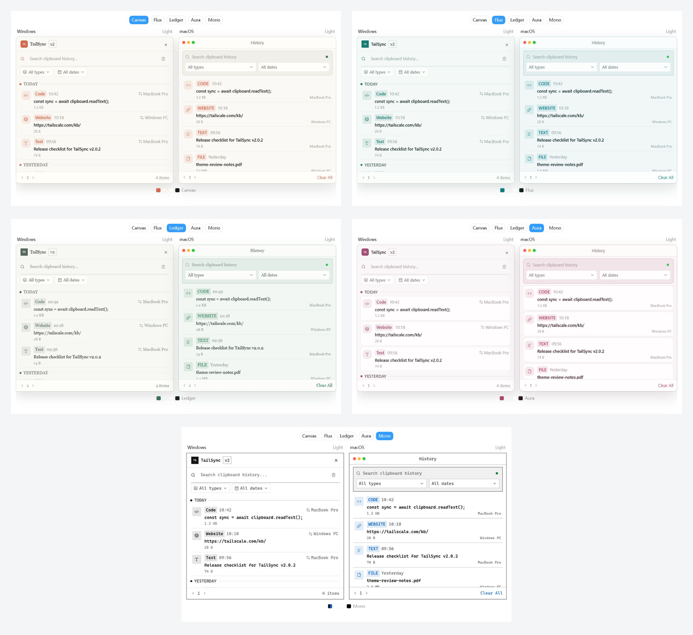
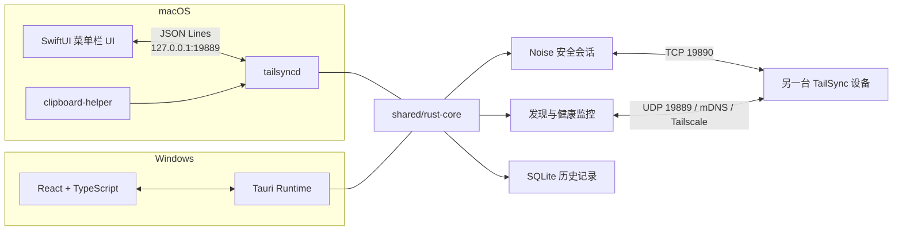

<div align="center">


# TailSync

### 让剪贴板跨设备自然流动

在 macOS 与 Windows 之间安全同步文本、图片和文件。

优先使用局域网，必要时通过 Tailscale 连接，全程由设备身份和加密会话保护。

[](#平台支持)
[](#平台支持)
[](#技术架构)
[](#安全模型)
[](https://github.com/monet4070/TailSync/tree/v2.0.2)
[](#许可证)

</div>

> [!NOTE]
> TailSync v2 目前处于积极开发阶段。macOS 与 Windows 客户端已经可以互相同步，公开分发前仍需完成正式签名、公证和更多真实设备验收。

## 为什么选择 TailSync

| | 能力 | 说明 |
|---|---|---|
| 📋 | 多类型剪贴板 | 双向同步文本、图片和文件，并保留本地历史记录 |
| ⚡ | 智能路由 | `auto` 模式优先选择可用的 LAN，必要时切换到 Tailscale |
| 🔐 | 安全配对 | 六位验证码、双端确认、固定设备身份和 Noise 加密连接 |
| 🩺 | 真实在线状态 | 单一后台任务主动探测，不再把残留的 mDNS 记录当成在线 |
| 🔁 | 可靠传输 | 消息 ACK、自动重试、重放抑制、文件分块校验和运行期断线续传 |
| 🖥️ | 原生体验 | macOS 菜单栏 SwiftUI 应用，Windows 系统托盘 Tauri 应用 |

## 平台支持

| 平台 | 状态 | 客户端形态 |
|---|---|---|
| macOS | ✅ 可用 | SwiftUI 菜单栏应用 + Rust 守护进程 |
| Windows | ✅ 可用 | React / TypeScript / Tauri 桌面应用 |
| Android | 🧪 尚未纳入 v2 | 不属于当前跨平台兼容范围 |

macOS 和 Windows 使用同一个 `shared/rust-core` crate 作为 v2 线协议、加密、身份、配对、历史存储和同步状态机的单一实现。两端只分别维护平台接入层，并通过契约与互操作测试验证边界一致性。

## 界面与主题

Windows 使用 React / Tauri 界面，macOS 使用原生 SwiftUI 界面。两端提供一致的五套视觉主题，并支持跟随系统、浅色和深色三种显示模式。

| 主题 | 视觉方向 |
|---|---|
| 画布 Canvas | 温暖、克制的编辑排版 |
| 流光 Flux | 清晰、利落的青绿色几何界面 |
| 书页 Ledger | 具有书卷感的衬线排版 |
| 柔光 Aura | 柔和、圆润的玫瑰色界面 |
| 单色 Mono | 强边界、高可读性的单色界面 |



> 对比图展示浅色模式。Windows 与 macOS 保留各自的平台交互和窗口结构，同时共享主题命名与核心色彩方向。

## 核心功能

- 文本、图片、文件双向同步
- 本地历史记录的搜索、恢复、删除和数量限制
- `auto`、`lan_only`、`tailscale_only` 三种连接策略
- UDP、mDNS / DNS-SD 与 Tailscale 候选发现
- LAN 与 Tailscale 独立健康检查及往返延迟显示
- `discovered`、`confirming`、`online`、`connected`、`offline` 状态模型
- Noise XX 握手、X25519 固定设备身份和 ChaCha20-Poly1305 加密
- 120 秒配对窗口、六位验证码、双向确认和失败锁闭
- 文本与图片事件 ACK、重试、时间戳检查和消息 ID 去重
- 1 MiB 文件分块、Blake3 校验、offset ACK 和运行期断线续传
- 中英文界面、五套视觉主题、系统 / 浅色 / 深色模式、通知、设备启停与路由选择

## 技术架构



`shared/rust-core` 负责：

- v2 帧协议、输入校验和 Noise 加密通道
- DEK、设置、固定设备身份和配对状态
- 历史数据库、图片/文件生命周期和存储配额
- 文本、图片和大文件同步状态机及可靠投递

两端的剪贴板、设备发现、连接池、Tauri/SwiftUI 桥接和系统托盘保留在各自应用 crate 中，通过 `SyncPlatform` 适配器接入共享同步引擎。

## 快速开始

1. 在 macOS 和 Windows 上分别启动 TailSync。
2. 在两端的“设置 → 连接与设备”中选择 `自动`、`仅局域网` 或 `仅 Tailscale`。
3. 两端都点击“允许配对”，核对相同的六位验证码和设备指纹。
4. 双方确认后，复制文本、图片或文件即可自动同步。

> [!TIP]
> 局域网模式要求设备之间能够直接路由。比如 `192.168.31.x/24` 与 `192.168.1.x/24` 默认属于不同子网，mDNS 通常也不会跨越路由器；这种情况下请配置网络路由，或直接使用 Tailscale。

## 设备在线状态

TailSync 不会仅凭“发现过这个设备”就长期显示在线。唯一的后台健康监控任务每 5 秒执行一轮探测：

| 状态 | 含义 |
|---|---|
| `discovered` | mDNS 或 Tailscale 曾经提供过地址，尚未收到有效响应 |
| `confirming` | 在线设备第一次健康检查失败，等待下一轮确认 |
| `online` | 最近收到了 UDP / TCP 响应 |
| `connected` | 当前存在通过 Noise 认证的连接，强制视为在线 |
| `offline` | 连续两轮失败，且不存在认证连接 |

因此正常情况下，对端断网后大约会在 **8–12 秒**内变为离线。Tailscale 自身显示 `Online` 只说明设备接入了 Tailnet，TailSync 仍会向对端主动发送心跳，确认应用服务确实在运行。

## 安全模型

- 每台设备拥有持久化的 X25519 身份密钥。
- 配对使用限时窗口、六位验证码和双方确认。
- 后续连接通过 Noise XX 完成握手，并校验已配对公钥。
- 认证失败时不会降级到旧版明文协议。
- 文本、图片和文件历史均使用系统保护的数据密钥加密存储。
- 文件历史使用 1 MiB 分块 AES-256-GCM 容器；恢复时只在受控剪贴板目录生成临时明文。

旧版协议 v1 与 v2 不兼容。升级后，需要在所有设备上重新完成配对。

旧版 TailSync v1 历史数据库会在首次启动时自动导入。迁移按内容哈希保持幂等，损坏条目会写入诊断报告但不会阻止启动；原 `history.db` 和 `.fernet_key` 会保留，不会被自动删除。

## 网络端口

| 端口 | 协议 | 用途 |
|---|---|---|
| `19889` | UDP | LAN / Tailscale 发现与健康心跳 |
| `19890` | TCP | 配对、认证和剪贴板数据传输 |
| `127.0.0.1:19889` | TCP，仅 macOS 本机 | SwiftUI 与 Rust 守护进程通信 |

macOS 本地 API 只应绑定 loopback，不要通过端口转发暴露到其他设备。

## 从源码运行

### macOS

需要 Rust、Swift 5.9+ 和 Xcode Command Line Tools。

```bash
cd macos
xcode-select --install
./dev.sh
```

构建本地应用包：

```bash
./build-mac.sh
open TailSync.app
```

`build-mac.sh` 会构建 SwiftUI 外壳、Rust 守护进程和剪贴板辅助程序，并生成 ad-hoc 签名的 `TailSync.app`。公开分发仍需 Developer ID 签名和 Apple 公证。

生成带 `Applications` 快捷方式、可作为 GitHub Release 附件的 DMG：

```bash
./build-dmg.sh
```

产物位于 `macos/release/`，并同时生成 SHA-256 校验文件。正式签名和公证：

```bash
TAILSYNC_CODESIGN_IDENTITY="Developer ID Application: Your Name (TEAMID)" \
TAILSYNC_NOTARY_PROFILE="tailsync-notary" \
./build-dmg.sh
```

### Windows

需要 Node.js、Rust 和 Visual Studio Build Tools，并安装“使用 C++ 的桌面开发”工作负载。

```powershell
cd windows
npm ci
npm run tauri:dev
```

构建 Windows 安装包：

```powershell
npm run tauri:build:win
```

产物位于 `src-tauri/target/release/bundle/`。

## 数据存储

macOS 默认数据目录：

```text
~/Library/Application Support/com.tailsync.TailSync/
```

主要文件：

| 路径 | 内容 |
|---|---|
| `history-v2.db` | 历史元数据、加密文本和内容引用 |
| `file-history/` | 分块 AEAD 加密的文件历史容器 |
| `image-history/` | 加密图片历史文件 |
| `incoming/` | 正在接收的临时文件与运行期续传状态 |
| `clipboard-files/` | 恢复到系统剪贴板的临时明文文件；启动时清理 |
| `config-v2.json` | 设置、信任公钥和已知设备地址 |
| `identity-v1.bin` | 本机固定设备身份 |

Windows 使用系统应用数据目录保存同一套结构。重新安装或替换应用程序本体不会主动删除历史、身份和配对信息。

## 开发验证

```bash
cargo fmt --manifest-path shared/rust-core/Cargo.toml --all -- --check
cargo test --locked --manifest-path shared/rust-core/Cargo.toml
cargo fmt --manifest-path macos/src-tauri/Cargo.toml --all -- --check
cargo test --locked --manifest-path macos/src-tauri/Cargo.toml --lib
swift test --package-path macos/swift-ui
```

跨平台改动还应运行契约检查和 Windows ↔ macOS 双向线协议测试。

## 仓库结构

```text
TailSync/
├── shared/
│   ├── rust-core/         # 协议、加密、身份、配对、历史和同步核心
│   ├── schema/            # Settings JSON Schema 与 TypeScript 生成器
│   └── art-direction.css  # Windows 工具窗口共享视觉变量
├── macos/                 # SwiftUI 外壳、平台适配层和 macOS 打包脚本
│   ├── swift-ui/
│   ├── src-tauri/
│   ├── build-mac.sh
│   └── build-dmg.sh
├── windows/               # React / Tauri Windows 客户端
│   ├── src/
│   └── src-tauri/
├── site/                  # 独立营销站点，不进入桌面安装包
├── assets/                # 项目图标与 README 展示资源
├── .github/workflows/     # CI 检查
└── README.md
```

平台 UI 和系统接入层可以按各自体验演进；共享业务规则只能在 `shared/rust-core` 修改。跨端改动合并前应通过契约检查、共享 core 测试和双向线协议测试。

## 当前限制

- 文件可以在应用运行期间断线续传，但应用重启后不会继续未完成传输。
- macOS 本地构建脚本生成的是 ad-hoc 签名应用，不是可公开分发的正式安装包。
- 尚未完成自动更新、正式发布签名和完整的真实设备回归矩阵。
- Android 客户端尚未纳入当前 v2 协议实现与兼容性保证。

## 许可证

TailSync 核心代码采用 [MIT License](LICENSE)。

---

<div align="center">

如果 TailSync 对你有帮助，欢迎点一个 ⭐

</div>
