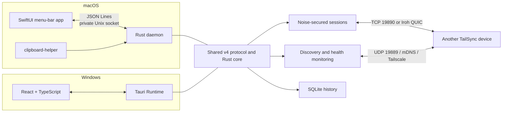

<div align="center">

[](README.md)
[](README.zh-CN.md)


# TailSync

### Let your clipboard flow naturally across devices

Securely sync text, images, and files between macOS and Windows.

TailSync prefers your local network and falls back to Tailscale when needed, with device identity and encrypted sessions protecting every transfer.

[](#platform-support)
[](#platform-support)
[](#architecture)
[](#security-model)
[](https://github.com/monet4070/TailSync/tree/v2.3.0)
[](#license)

</div>

> [!NOTE]
> TailSync 2.3.0 is under active development. The macOS and Windows clients can already sync with each other and recover automatically after sleep or wake. Tagged builds produce a free Community Release by default: update packages still carry a TailSync private-key signature, SHA-256 checksums, and downgrade protection, but the macOS build is not notarized and the Windows build has no commercial code signature. Paid platform signing can be enabled later as a Trusted Release. Real-device acceptance testing is still required before the first public release.

## Why TailSync

| | Capability | What it does |
|---|---|---|
| 📋 | Multiple clipboard types | Syncs text, images, and files in both directions while keeping local history |
| ⚡ | Smart routing | Prefers an available LAN route in `auto` mode and switches to Tailscale when needed |
| 🔐 | Secure pairing | Uses a six-digit code, confirmation on both devices, pinned device identities, Noise-encrypted connections, and short-lived Iroh invite links |
| 🩺 | Accurate presence | Actively probes peers from one background task instead of treating stale mDNS records as online devices |
| 🔋 | Wake recovery | Preserves original event times, cancels stale connections, and resets clipboard monitoring after wake |
| 🗂️ | Smart history | Filters text, images, and files by category or date, with search and restore support |
| 🔁 | Reliable delivery | Provides message ACKs, automatic retries, replay suppression, chunk verification, and file-transfer resume after either app restarts |
| 🖥️ | Native experience | Provides a SwiftUI menu-bar app on macOS and a Tauri system-tray app on Windows |

## Platform support

| Platform | Status | Client |
|---|---|---|
| macOS | ✅ Available | SwiftUI menu-bar app + Rust daemon |
| Windows | ✅ Available | React / TypeScript / Tauri desktop app |
| Android | 🧪 Not yet supported | Outside the current cross-platform compatibility scope |

macOS uses native SwiftUI, while Windows uses React and Tauri. Both clients share the v4 wire protocol, encryption, history storage, and synchronization state machine in `shared/rust-core`; cross-platform drift checks keep their contracts aligned.

## Features

- Bidirectional synchronization of text, images, and files
- Local history with search, favorites, restore, protected deletion, item limits, category filters, and date filters
- `auto`, `lan_only`, `iroh_only`, and `tailscale_only` connection policies
- Peer discovery over UDP, mDNS / DNS-SD, and Tailscale
- Independent LAN and Tailscale health checks with round-trip latency
- `discovered`, `confirming`, `online`, `connected`, and `offline` presence states
- Noise XX handshakes, persistent X25519 device identities, and ChaCha20-Poly1305 encryption
- A 120-second pairing window, six-digit verification code, two-sided confirmation, and failure lockout
- Serverless `tailsync://` Iroh links for remote pairing; each link is single-use, expires after 120 seconds, and still requires code and fingerprint confirmation
- ACKs, retries, timestamp validation, and message-ID deduplication for text and image events
- 1 MiB file chunks, BLAKE3 verification, offset ACKs, persistent sender journals, and resume after either the sender or receiver restarts
- Iroh QUIC relay and hole-punching paths; route measurement reuses the app's persistent Endpoint to report repeated `direct` / `relay` path types and RTT
- Sleep / wake recovery that preserves reliable-event timestamps, cancels stale connection workers, and resets clipboard monitoring
- Clipboard-listener liveness in daemon health checks, so a stopped listener is no longer reported as healthy
- Loop prevention for files managed in `clipboard-files/`, keeping received files from being sent back to their origin
- Filename sanitization, a 1 GiB receive limit, and inbound connection limits
- English and Simplified Chinese interfaces, localized tray menus, light / dark / system appearance, five built-in color themes, notifications, device controls, and route selection
- Custom themes (Theme V2): import `.tailsync-theme` bundles containing a `theme.json` manifest and optional `assets/`, then enable, update, or remove them beside the built-in themes. Theme selection is a local preference stored in `themes-v2/local-settings.json`; missing bundles fall back to the default theme. See [`docs/THEMING.md`](docs/THEMING.md).

## Architecture



`shared/rust-core` provides:

- The v4 frame protocol, input validation, and Noise-encrypted channels
- The data-encryption key (DEK), settings, persistent device identity, and pairing state
- The history database, image / file lifecycle, and storage quotas
- Reliable-delivery state machines for text, images, and large files

Platform-specific clipboard access, device discovery, connection pools, Tauri / SwiftUI bridges, and system-tray integration stay in their application crates. Both clients connect them to the shared synchronization engine through the `SyncPlatform` adapter.

## Quick start

> First time using TailSync? The [TailSync Practical Guide](docs/USER_GUIDE.zh-CN.md) covers installation, pairing, history previews, file batches, themes, storage management, and troubleshooting. The guide is currently available in Simplified Chinese.

1. Start TailSync on both your macOS and Windows devices.
2. On each device, open **Settings → Connections & Devices** and choose `Auto`, `LAN Only`, `Iroh Only`, or `Tailscale Only`.
3. Select **Allow pairing** on one device and connect from the other. Verify that the same six-digit code and device fingerprints appear on both devices.
4. Confirm on both devices, then copy text, images, or files to sync them automatically.

> [!TIP]
> LAN mode requires direct routing between devices. For example, `192.168.31.x/24` and `192.168.1.x/24` are different subnets by default, and mDNS usually does not cross routers. Configure routing between the networks or use Tailscale instead.

## Device presence

TailSync does not keep a device online merely because it was discovered earlier. One background health-monitoring task probes every five seconds:

| State | Meaning |
|---|---|
| `discovered` | mDNS or Tailscale supplied an address, but no valid response has arrived yet |
| `confirming` | The first health check for an online device failed; TailSync waits for the next check before declaring it offline |
| `online` | A UDP or TCP response arrived recently |
| `connected` | A Noise-authenticated connection is active, so the device is always considered online |
| `offline` | Two consecutive checks failed and no authenticated connection exists |

Under normal conditions, a disconnected peer becomes **offline in about 8–12 seconds**. Tailscale's own `Online` status only means the device is connected to the tailnet; TailSync still sends an active heartbeat to confirm that the application service is running.

## Security model

- Every device has a persistent X25519 identity key.
- Pairing uses a time-limited window, a six-digit code, and confirmation on both devices.
- Later connections perform a Noise XX handshake and verify the paired public key.
- Authentication failures never downgrade to the legacy plaintext protocol.
- Text, image, and file history is encrypted at rest with a system-protected data key.
- File history uses 1 MiB AES-256-GCM chunk containers; restore operations write temporary plaintext only into a controlled clipboard directory.

The current wire protocol is v4. It adds atomic pairing-commit confirmation and atomic file batches. Peers exchange protocol versions during the handshake and show a clear prompt to update both clients when the versions differ. Pinned device identities remain valid across a protocol upgrade, so re-pairing is not required for that reason alone. The current product version is 2.3.0, and the database schema is v11; these three version numbers are independent.

TailSync imports legacy v1 history databases on first launch. Migration is idempotent by content hash; corrupted entries are written to a diagnostic report without preventing startup. The original `history.db` and `.fernet_key` files are retained and never deleted automatically.

## Network ports

| Port | Protocol | Purpose |
|---|---|---|
| `19889` | UDP | LAN / Tailscale discovery and health heartbeats |
| `19890` | TCP | Pairing, authentication, and clipboard data transfer |
| `tailsyncd.sock` under macOS Application Support | Unix socket, local only | Communication between the SwiftUI shell and Rust daemon, with peer PID and capability-token checks |

LAN discovery advertises the mDNS service `_tailsync._tcp.local.`. On macOS, the local API uses a Unix socket in a user-specific directory and does not listen on local TCP. The Windows local API still uses `127.0.0.1:19889`; do not expose it to other devices through port forwarding.

## Run from source

### macOS

Requires Rust, Swift 5.9+, and Xcode Command Line Tools.

```bash
cd macos
xcode-select --install
./dev.sh
```

Build a local application bundle:

```bash
./build-mac.sh
open TailSync.app
```

`build-mac.sh` builds the SwiftUI shell, Rust daemon, and clipboard helper. Local builds and Community Releases use ad-hoc signing by default. Developer ID signing and notarization are enabled only when the release tier is set to `trusted` and Apple Developer credentials are configured.

Build a DMG with an `Applications` shortcut that can be attached to a GitHub Release:

```bash
./build-dmg.sh
```

Artifacts are written to `macos/release/` along with SHA-256 checksum files. To create an updater-signed Community Release:

```bash
TAILSYNC_RELEASE=1 \
TAILSYNC_RELEASE_TIER=community \
TAURI_SIGNING_PRIVATE_KEY="..." \
./build-dmg.sh
```

Gatekeeper still warns the first time a Community Release is opened. Once paid signing accounts are available, follow the [release guide](docs/RELEASE.md) to switch to a Trusted Release without changing the updater key or wire protocol.

### Windows

Requires Node.js, Rust, and Visual Studio Build Tools with the **Desktop development with C++** workload.

```powershell
cd windows
npm ci
npm run tauri:dev
```

Build and smoke-test the Windows installer:

```powershell
./scripts/package-windows.ps1
```

Official tags produce a Community Release without Authenticode by default, while still requiring a signed updater ZIP that is generated and verified during release. A code-signing certificate can enable Trusted Releases later. See the [release guide](docs/RELEASE.md) for the complete key, certificate, and release procedure.

## Data storage

The default macOS data directory is:

```text
~/Library/Application Support/com.tailsync.TailSync/
```

Important files and directories:

| Path | Contents |
|---|---|
| `history-v2.db` | History metadata, encrypted text, and content references; text previews are decrypted only when read |
| `file-history/` | Chunked AEAD-encrypted file-history containers |
| `image-history/` | Encrypted image-history files |
| `incoming/` | Plaintext `.part` files and cross-restart state for active receives, retained for at most 24 hours |
| `outgoing-transfers/` | Private journal of pending file batches and source paths, removed after completion or expiry |
| `clipboard-files/` | Temporary plaintext files restored to the system clipboard, periodically removed when unreferenced for more than 10 minutes |
| `config-v2.json` | Settings, trusted public keys, and known device addresses |
| `identity-v1.bin` | Persistent identity of this device |

Windows stores the same structure in the system application-data directory. Reinstalling or replacing the application itself does not actively delete history, identity, or pairing data.

The `description` column for text history contains only a fixed placeholder. Keyword searches decrypt text before matching. Deleting history also enables SQLite `secure_delete` and truncates the WAL so plaintext previews or deleted pages do not remain in sidecar files.

## Development and verification

Documentation is split into current specifications and historical review records. See [`docs/README.md`](docs/README.md) for the index. When implementation changes, update the current specification first; keep dated reviews and handoff documents as historical evidence instead of rewriting their past findings as if they were current.

```bash
cargo fmt --manifest-path shared/rust-core/Cargo.toml --all -- --check
cargo test --locked --manifest-path shared/rust-core/Cargo.toml
cargo fmt --manifest-path macos/src-tauri/Cargo.toml --all -- --check
cargo test --locked --manifest-path macos/src-tauri/Cargo.toml --lib
swift test --package-path macos/swift-ui
```

Changes to shared source code should also run the cross-platform drift check:

```bash
node windows/scripts/check_cross_platform_sync.mjs \
  --win-root windows \
  --mac-root macos \
  --core-root shared/rust-core
```

After packaging macOS, run the full verification suite for the frontend, Rust, SwiftUI, Bonjour declaration, `19890` listener, Unix-socket API, and clipboard helper:

```bash
bash macos/scripts/verify_macos_release.sh "$PWD/windows"
```

## Repository structure

```text
TailSync/
├── macos/                 # macOS client: SwiftUI menu-bar app, Rust daemon, and packaging scripts
│   ├── src-tauri/         #   Rust daemon and macOS platform adapter
│   ├── swift-ui/          #   SwiftUI menu-bar shell
│   ├── scripts/           #   Drift checks, migration, and release verification
│   ├── build-mac.sh
│   └── build-dmg.sh
├── windows/               # Windows client: React / Tauri system-tray app
│   ├── src/
│   ├── src-tauri/
│   └── scripts/
├── shared/                # Shared Rust core, settings schema, and visual specification
├── docs/                  # Documentation index, user guide, ADRs, feature specs, and release / dependency guides
├── site/                  # Standalone project website
├── .github/workflows/     # CI checks
├── assets/                # Project presentation assets
├── README.md              # Default English README
└── README.zh-CN.md        # Simplified Chinese README
```

The macOS and Windows interfaces may evolve independently to match their respective platforms. Shared business rules change only in `shared/rust-core`. Before merging cross-platform changes, run generated-contract checks, shared-core tests, drift checks, and bidirectional wire-protocol tests.

## Current limitations

- Incomplete file batches can resume after the sender or receiver exits, crashes, or restarts. Sender journals and receiver `.part` files / manifests are retained for at most 24 hours. Resume starts at the receiver's last verified offset, then verifies every file again when the batch completes. See [resumable file transfers](docs/features/resumable-file-transfer.md).
- The macOS local JSON Lines API uses a Unix socket in a user-specific directory and requires peer-PID validation plus a 256-bit capability token on every request. Requests are limited to 1 MiB with five-second read and write timeouts. Only the Windows local API uses `127.0.0.1:19889`, and it should not be exposed through port forwarding.
- History bodies and image / file payloads are encrypted with the application data key. Database metadata such as type and timestamp is not encrypted; full-disk encryption can provide additional protection.
- Tagged builds are Community Releases by default. macOS uses ad-hoc signing without notarization, and Windows has no commercial Authenticode signature, so Gatekeeper or SmartScreen warns on first launch. Do not bypass these warnings by disabling operating-system security features.
- Updater signing, the stable-channel manifest, and downgrade protection are implemented, but the first online update and complete real-device regression matrix have not yet been completed with this repository's credentials. Pre-release tags do not enter the stable update channel.
- Android is not part of the current v4 implementation or compatibility guarantee.

## License

TailSync core code is available under the [MIT License](LICENSE).

---

<div align="center">

If TailSync helps you, consider giving the project a ⭐

</div>
