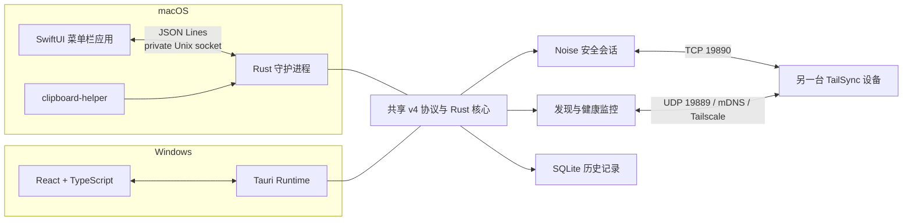

<div align="center">


# TailSync

### 让剪贴板跨设备自然流动

在 macOS 与 Windows 之间安全同步文本、图片和文件。

优先使用局域网，必要时通过 Tailscale 连接，全程由设备身份和加密会话保护。

[](#平台支持)
[](#平台支持)
[](#技术架构)
[](#安全模型)
[](https://github.com/monet4070/TailSync/tree/v2.2.2)
[](#许可证)

</div>

> [!NOTE]
> TailSync 2.2.2 目前处于积极开发阶段。macOS 与 Windows 客户端已经可以互相同步，并支持休眠/唤醒后自动恢复。tag 流水线默认生成免费的 Community Release：更新包仍有 TailSync 私钥签名、SHA-256 校验和降级保护，但 macOS 未公证、Windows 无商业代码签名；付费平台签名可在以后切换为 Trusted Release。首次公开发布前仍需完成真实设备验收。

## 为什么选择 TailSync

| | 能力 | 说明 |
|---|---|---|
| 📋 | 多类型剪贴板 | 双向同步文本、图片和文件，并保留本地历史记录 |
| ⚡ | 智能路由 | `auto` 模式优先选择可用的 LAN，必要时切换到 Tailscale |
| 🔐 | 安全配对 | 六位验证码、双端确认、固定设备身份和 Noise 加密连接 |
| 🩺 | 真实在线状态 | 单一后台任务主动探测，不再把残留的 mDNS 记录当成在线 |
| 🔋 | 唤醒恢复 | 睡眠唤醒后保留原始事件时间、取消过期连接并重置剪贴板监听 |
| 🗂️ | 智能历史 | 文本 / 图片 / 文件分类、日期筛选、搜索与恢复 |
| 🔁 | 可靠传输 | 消息 ACK、自动重试、重放抑制、文件分块校验和运行期断线续传 |
| 🖥️ | 原生体验 | macOS 菜单栏 SwiftUI 应用，Windows 系统托盘 Tauri 应用 |

## 平台支持

| 平台 | 状态 | 客户端形态 |
|---|---|---|
| macOS | ✅ 可用 | SwiftUI 菜单栏应用 + Rust 守护进程 |
| Windows | ✅ 可用 | React / TypeScript / Tauri 桌面应用 |
| Android | 🧪 尚未支持 | 不属于当前跨平台兼容范围 |

macOS 使用原生 SwiftUI，Windows 使用 React/Tauri；两端共享 `shared/rust-core` 中的 v4 线协议、加密、历史存储和同步状态机，并通过跨平台漂移检查保持契约一致。

## 核心功能

- 文本、图片、文件双向同步
- 本地历史记录的搜索、收藏、恢复、受保护删除、数量限制，以及文本 / 图片 / 文件分类和日期筛选
- `auto`、`lan_only`、`tailscale_only` 三种连接策略
- UDP、mDNS / DNS-SD 与 Tailscale 候选发现
- LAN 与 Tailscale 独立健康检查及往返延迟显示
- `discovered`、`confirming`、`online`、`connected`、`offline` 状态模型
- Noise XX 握手、X25519 固定设备身份和 ChaCha20-Poly1305 加密
- 120 秒配对窗口、六位验证码、双向确认和失败锁闭
- 文本与图片事件 ACK、重试、时间戳检查和消息 ID 去重
- 1 MiB 文件分块、Blake3 校验、offset ACK 和运行期断线续传
- 睡眠 / 唤醒恢复：保留可靠事件的原始时间戳、取消过期连接 worker 并重置剪贴板监听
- 剪贴板监听活性纳入守护进程健康检查，不再把已停止工作的监听误判为健康
- 文件回传抑制：应用托管的 `clipboard-files/` 文件不会被回传给原发送端
- 文件名清理、1 GiB 接收上限和入站连接数限制
- 中英文界面与本地化托盘菜单、浅色 / 深色 / 跟随系统及五套配色主题、通知、设备启停与路由选择
- 自定义主题（Theme V2）：导入 `.tailsync-theme` 主题包（`theme.json` 清单 + 可选 `assets/`），在设置页启用、更新与删除，与内置主题并列；主题选择为本地偏好（`themes-v2/local-settings.json`），缺包时自动回退默认主题，详见 `docs/THEMING.md`

## 技术架构



`shared/rust-core` 负责：

- v4 帧协议、输入校验和 Noise 加密通道
- DEK、设置、固定设备身份和配对状态
- 历史数据库、图片/文件生命周期和存储配额
- 文本、图片和大文件同步状态机及可靠投递

两端的剪贴板、设备发现、连接池、Tauri/SwiftUI 桥接和系统托盘保留在各自应用 crate 中，通过 `SyncPlatform` 适配器接入共享同步引擎。

## 快速开始

> 第一次使用？请阅读[《TailSync 实用指南》](docs/USER_GUIDE.zh-CN.md)，其中包含安装、配对、历史预览、文件批次、主题、存储管理和常见故障排查。

1. 在 macOS 和 Windows 上分别启动 TailSync。
2. 在两端的“设置 → 连接与设备”中选择 `自动`、`仅局域网` 或 `仅 Tailscale`。
3. 一端点击“允许配对”，另一端点击连接按钮，核对相同的六位验证码和设备指纹。
4. 双方确认后，复制文本、图片或文件即可自动同步。

> [!TIP]
> 局域网模式要求设备之间能够直接路由。比如 `192.168.31.x/24` 与 `192.168.1.x/24` 默认属于不同子网，mDNS 通常也不会跨越路由器；这种情况下请配置网络路由，或直接使用 Tailscale。

## 设备在线状态

TailSync 不会仅凭“发现过这个设备”就长期显示在线。唯一的后台健康监控任务每 5 秒执行一轮探测：

| 状态 | 含义 |
|---|---|
| `discovered` | mDNS 或 Tailscale 曾经提供过地址，尚未收到有效响应 |
| `confirming` | 在线设备第一次健康检查失败，等待下一轮确认 |
| `online` | 最近收到了 UDP / TCP 响应 |
| `connected` | 当前存在通过 Noise 认证的连接，强制视为在线 |
| `offline` | 连续两轮失败，且不存在认证连接 |

因此正常情况下，对端断网后大约会在 **8–12 秒**内变为离线。Tailscale 自身显示 `Online` 只说明设备接入了 Tailnet，TailSync 仍会向对端主动发送心跳，确认应用服务确实在运行。

## 安全模型

- 每台设备拥有持久化的 X25519 身份密钥。
- 配对使用限时窗口、六位验证码和双方确认。
- 后续连接通过 Noise XX 完成握手，并校验已配对公钥。
- 认证失败时不会降级到旧版明文协议。
- 文本、图片和文件历史均使用系统保护的数据密钥加密存储。
- 文件历史使用 1 MiB 分块 AES-256-GCM 容器；恢复时只在受控剪贴板目录生成临时明文。

当前线协议为 v4，加入了原子配对提交确认和原子文件批次；握手会交换协议版本，不匹配时明确提示同时更新两端。已固定的设备身份仍然有效，无需仅因协议升级重新配对。当前产品版本为 2.2.2，数据库 schema 为 v11，这三个版本号彼此独立。

旧版 TailSync v1 历史数据库会在首次启动时自动导入。迁移按内容哈希保持幂等，损坏条目会写入诊断报告但不会阻止启动；原 `history.db` 和 `.fernet_key` 会保留，不会被自动删除。

## 网络端口

| 端口 | 协议 | 用途 |
|---|---|---|
| `19889` | UDP | LAN / Tailscale 发现与健康心跳 |
| `19890` | TCP | 配对、认证和剪贴板数据传输 |
| macOS Application Support 下的 `tailsyncd.sock` | Unix socket，仅本机 | SwiftUI 外壳与 Rust 守护进程通信；校验连接对端 PID 和能力令牌 |

局域网发现使用 mDNS 服务名 `_tailsync._tcp.local.`。macOS 本地 API 使用用户专属目录下的 Unix socket，不监听本地 TCP 端口；Windows 本地 API 仍使用 `127.0.0.1:19889`，不要通过端口转发暴露到其他设备。

## 从源码运行

### macOS

需要 Rust、Swift 5.9+ 和 Xcode Command Line Tools。

```bash
cd macos
xcode-select --install
./dev.sh
```

构建本地应用包：

```bash
./build-mac.sh
open TailSync.app
```

`build-mac.sh` 会构建 SwiftUI 外壳、Rust 守护进程和剪贴板辅助程序。默认本地构建和 Community Release 使用 ad-hoc 签名；只有将发布层级切换为 `trusted` 并配置 Apple Developer 凭据后，才使用 Developer ID 签名和公证。

生成带 `Applications` 快捷方式、可作为 GitHub Release 附件的 DMG：

```bash
./build-dmg.sh
```

产物位于 `macos/release/`，并同时生成 SHA-256 校验文件。生成带 updater 签名的 Community Release：

```bash
TAILSYNC_RELEASE=1 \
TAILSYNC_RELEASE_TIER=community \
TAURI_SIGNING_PRIVATE_KEY="..." \
./build-dmg.sh
```

Community Release 首次打开仍会触发 Gatekeeper 警告。未来具备付费账号后，可按[发布手册](docs/RELEASE.md)切换为 Trusted Release，无需更换 updater 密钥或更新协议。

### Windows

需要 Node.js、Rust 和 Visual Studio Build Tools，并安装“使用 C++ 的桌面开发”工作负载。

```powershell
cd windows
npm ci
npm run tauri:dev
```

构建并烟测 Windows 安装包：

```powershell
./scripts/package-windows.ps1
```

正式 tag 默认生成无 Authenticode 的 Community Release，同时强制生成并验证签名 updater ZIP。未来配置代码签名证书后可切换为 Trusted Release。完整的密钥、证书和发布步骤见[发布手册](docs/RELEASE.md)。

## 数据存储

macOS 默认数据目录：

```text
~/Library/Application Support/com.tailsync.TailSync/
```

主要文件：

| 路径 | 内容 |
|---|---|
| `history-v2.db` | 历史元数据、加密文本和内容引用；文本预览仅在读取时解密 |
| `file-history/` | 分块 AEAD 加密的文件历史容器 |
| `image-history/` | 加密图片历史文件 |
| `incoming/` | 正在接收的临时文件与运行期续传状态 |
| `clipboard-files/` | 恢复到系统剪贴板的临时明文文件；未被剪贴板引用且超过 10 分钟后定期清理 |
| `config-v2.json` | 设置、信任公钥和已知设备地址 |
| `identity-v1.bin` | 本机固定设备身份 |

Windows 使用系统应用数据目录保存同一套结构。重新安装或替换应用程序本体不会主动删除历史、身份和配对信息。
文本历史的 `description` 列只保存固定占位符，关键词搜索在解密后执行；删除历史时同时启用 SQLite `secure_delete` 并截断 WAL，避免明文预览或已删页残留在旁路文件。

## 开发验证

```bash
cargo fmt --manifest-path shared/rust-core/Cargo.toml --all -- --check
cargo test --locked --manifest-path shared/rust-core/Cargo.toml
cargo fmt --manifest-path macos/src-tauri/Cargo.toml --all -- --check
cargo test --locked --manifest-path macos/src-tauri/Cargo.toml --lib
swift test --package-path macos/swift-ui
```

共享源码改动还应运行跨平台漂移检查：

```bash
node windows/scripts/check_cross_platform_sync.mjs \
  --win-root windows \
  --mac-root macos \
  --core-root shared/rust-core
```

macOS 打包后完整验证（前端、Rust、SwiftUI、Bonjour 声明、`19890` 监听、Unix socket API 与剪贴板辅助进程）：

```bash
bash macos/scripts/verify_macos_release.sh "$PWD/windows"
```

## 仓库结构

```text
TailSync/
├── macos/                 # macOS 客户端：SwiftUI 菜单栏应用、Rust 守护进程与打包脚本
│   ├── src-tauri/         #   Rust 守护进程和 macOS 平台适配层
│   ├── swift-ui/          #   SwiftUI 菜单栏外壳
│   ├── scripts/           #   漂移检查、迁移和发布验证脚本
│   ├── build-mac.sh
│   └── build-dmg.sh
├── windows/               # Windows 客户端：React / Tauri 系统托盘应用
│   ├── src/
│   ├── src-tauri/
│   └── scripts/
├── shared/                # 共享 Rust 核心、设置 schema 和视觉规范
├── docs/                  # 发布操作手册
├── site/                  # 独立项目站点
├── .github/workflows/     # CI 检查
├── assets/                # 项目展示资源
└── README.md
```

macOS 与 Windows 的平台 UI 可以按系统体验分别演进；共享业务规则只在 `shared/rust-core` 修改。跨端合并前应通过生成契约检查、共享 core 测试、漂移检查和双向线协议测试。

## 当前限制

- 未完成文件批次可跨应用重启续传，`incoming/` 中的明文 `.part` 文件和续传状态最多保留 24 小时；`clipboard-files/` 中恢复到剪贴板的明文文件也属于瞬态数据。
- macOS 本地 JSON-lines API 使用用户专属 Unix socket，并对连接对端 PID 及每个请求强制校验 256 位能力令牌；请求上限为 1 MiB，读写超时为 5 秒。Windows 本地 API 才使用 `127.0.0.1:19889`，仍不应通过端口转发暴露。
- 历史正文与图片/文件负载由应用数据密钥加密；类型、时间戳等数据库元数据不加密，系统磁盘加密仍可提供额外的整盘保护。
- 默认 tag 产物是 Community Release：macOS 使用 ad-hoc 签名且未公证，Windows 不含商业 Authenticode 签名，因此首次打开会出现 Gatekeeper 或 SmartScreen 警告；不要通过关闭系统安全功能来规避警告。
- updater 签名、稳定通道 manifest 和降级保护已经接入，但尚未在本仓库凭据下完成首次线上更新及完整真实设备回归矩阵。预发布 tag 不进入稳定更新通道。
- Android 客户端尚未纳入当前 v4 协议实现与兼容性保证。

## 许可证

TailSync 核心代码采用 [MIT License](LICENSE)。

---

<div align="center">

如果 TailSync 对你有帮助，欢迎点一个 ⭐

</div>
